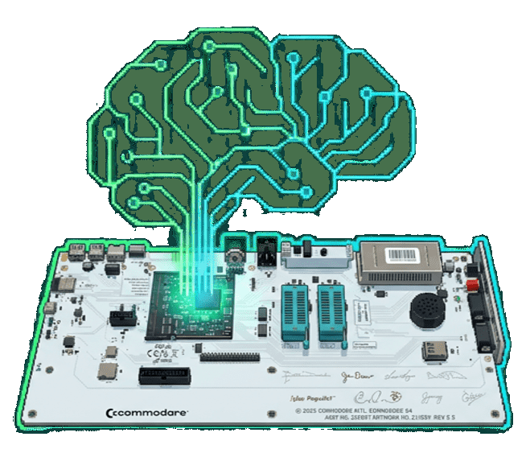

# C64 Ultimate MCP Server

**English** | [**Polski**](#-c64-ultimate-mcp-server-polski)

> ⚙️ **This project was built 100% using AI Agent prompts** - Every line of code, configuration, and documentation was generated through conversational prompts to GitHub Copilot Agent.


Comprehensive **Model Context Protocol (MCP)** server for the **Commodore 64 Ultimate** device with **45+ tools** for complete control. Built in C# with enterprise-grade architecture, type safety, and comprehensive API coverage.

**License:** MIT License (see [LICENSE](LICENSE) file)

## ⚡ Key Features

- **Complete Ultimate 64 API Support**: All 45+ tools from the 1541U REST API
- **BASIC to PRG Compilation**: Real-time compilation of BASIC V2 source code to executable PRG files
- **Separated Client Library**: Reusable `C64UltimateClient` NuGet package with clean async API
- **Clean Architecture**: Client → Service → MCP wrapper pattern with proper DI
- **HTTP/SSE Transport**: Remote multi-client support with session management
- **Streaming Support**: Video, audio, and debug streaming capabilities
- **Binary File Support**: Upload PRG files via base64, file path, or URL
- **ASP.NET Core 8.0/10.0**: Modern, high-performance web framework
- **Enterprise Configuration**: appsettings.json with environment overrides
- **Type Safety**: C# static typing with full null-safety and nullable reference types
- **Structured Logging**: Separate loggers for client and service layers
- **Production-Ready**: Zero errors/warnings, comprehensive error handling
- **Agent Integration**: Works with Continue, Copilot, Cody, Cursor, Claude Desktop

## 🚀 Quick Start

```bash
# 1. Build
dotnet build

# 2. Configure (optional, defaults to http://192.168.0.120)
export Ultimate__BaseUrl=http://your-c64-ultimate-ip:port

# 3. Run
dotnet run

# 4. Server starts on http://localhost:8080
```

## 📦 Installation

### Requirements
- **.NET 8.0 SDK** - [Download](https://dotnet.microsoft.com/download)
- **C64 Ultimate device** - On your network
- **Curl or HTTP client** - For testing

### Setup

```bash
git clone https://github.com/ch0mik/C64UltimateMcpServer.git
cd C64UltimateMcpServer
dotnet build
dotnet run
```

### Docker

```bash
docker-compose up
# Server: http://localhost:8080
# Inspector: http://localhost:6274
```

## ⚙️ Configuration

### appsettings.json
```json
{
  "Ultimate": {
    "BaseUrl": "http://192.168.0.120"
  }
}
```

### Environment Variable
```bash
Ultimate__BaseUrl=http://192.168.0.120
```

### Docker
```yaml
environment:
  - Ultimate__BaseUrl=http://192.168.0.120
```

## 🤖 Agent Integration

### Continue IDE (Recommended)

1. **Install Continue** - https://continue.dev
2. **Configure** `.continue/config.json`:
```json
{
  "models": [
    {
      "title": "Claude",
      "provider": "openai",
      "model": "claude-3-5-sonnet"
    }
  ],
  "mcp_servers": {
    "c64-ultimate": {
      "url": "http://localhost:8080"
    }
  }
}
```

3. **Use in Chat**:
```
@C64 reboot the device
@C64 load and run /games/loderunner.prg
@C64 what config categories are available?
```

### VS Code Chat (GitHub Copilot)

1. **Install** - GitHub Copilot Chat extension
2. **Configure** `.vscode/settings.json`:
```json
{
  "github.copilot.chat.mcpServers": [
    {
      "name": "C64 Ultimate",
      "url": "http://localhost:8080"
    }
  ]
}
```

3. **Use**:
```
@C64 reboot device
@C64 mount disk /games/disk1.d64
```

### Cody (Sourcegraph)

```bash
cody mcp add c64-ultimate http://localhost:8080
```

Then in Cody:
```
Ask Cody: Use C64 Ultimate MCP to reboot the device
Ask Cody: List all available config categories
```

### Cursor IDE

1. **Configure** `.cursor/mcp.json`:
```json
{
  "servers": [
    {
      "name": "C64 Ultimate",
      "type": "http",
      "url": "http://localhost:8080"
    }
  ]
}
```

2. **Use slash commands**:
```
/c64 reboot device
/c64 load program
```

## 🛠️ Tools (46 Total)

### Connection Management (3)
- `ultimate_set_connection` - Set device hostname/port
- `ultimate_get_connection` - Get connection details
- `ultimate_version` - Get API version

### BASIC Program Generation (1)
- `ultimate_generate_basic_prg` - Generate C64 BASIC PRG from source code

### Audio Playback (2)
- `ultimate_play_sid` - Play SID music file
- `ultimate_play_mod` - Play Amiga MOD file

### Program Execution (4)
- `ultimate_load_program` - Load PRG into memory
- `ultimate_run_program` - Load and execute PRG
- `ultimate_run_prg_binary` - Upload & run (base64/file/URL)
- `ultimate_run_cartridge` - Load cartridge

### Configuration (8)
- `ultimate_get_config_categories` - List categories
- `ultimate_get_config_category` - Get category items
- `ultimate_get_config_item` - Get specific value
- `ultimate_set_config_item` - Set config value
- `ultimate_bulk_config_update` - Update multiple settings
- `ultimate_save_config` - Save to flash
- `ultimate_load_config` - Load from flash
- `ultimate_reset_config` - Factory reset

### Drive Operations (6)
- `ultimate_mount_disk` - Mount disk image
- `ultimate_unmount_disk` - Unmount drive
- `ultimate_turn_drive_on` - Power on drive
- `ultimate_turn_drive_off` - Power off drive
- `ultimate_set_drive_mode` - Set mode (1541/1571/1581)
- `ultimate_load_drive_rom` - Load drive ROM

### Disk Image Creation (4)
- `ultimate_create_d64` - Create D64 image
- `ultimate_create_d71` - Create D71 image (128K)
- `ultimate_create_d81` - Create D81 image (3.5")
- `ultimate_create_dnp` - Create DNP (custom tracks)

### File Operations (1)
- `ultimate_get_file_info` - Get file information

### Memory Operations (3)
- `ultimate_read_memory` - Read C64 memory
- `ultimate_write_memory` - Write hex data
- `ultimate_write_memory_binary` - Write binary file

### Machine Control (5)
- `ultimate_reset_machine` - Hard reset
- `ultimate_soft_reset` - Soft reset
- `ultimate_power_off` - Power down
- `ultimate_reboot_device` - Restart device
- `ultimate_get_machine_info` / `ultimate_get_machine_state` - Status

### Streaming (2)
- `ultimate_start_stream` - Start video/audio/debug stream
- `ultimate_stop_stream` - Stop active stream

## 📝 Examples

### HTTP/cURL

All HTTP examples are available in `examples_http/` folder. Key examples:

**Reboot Device** - See [mcp_reboot_device.http](examples_http/mcp_reboot_device.http):
```bash
curl -X POST http://localhost:8080/ \
  -H "Content-Type: application/json" \
  -H "Accept: application/json, text/event-stream" \
  -d '{
    "jsonrpc": "2.0",
    "id": 1,
    "method": "tools/call",
    "params": {
      "name": "ultimate_reboot_device",
      "arguments": {}
    }
  }'
```

**Mount Disk** - See [mcp_mount_disk.http](examples_http/mcp_mount_disk.http)

**Run PRG Binary** - See [TEST_RUN_PRG_BINARY.http](examples_http/TEST_RUN_PRG_BINARY.http)

**Play SID File** - See [TEST_PLAY_SID_BINARY.http](examples_http/TEST_PLAY_SID_BINARY.http)

All 45+ tools have corresponding `.http` files in `examples_http/` for testing

### Continue IDE

```
@C64 Create a BASIC program that prints "HELLO WORLD" and run it
@C64 Mount the disk image games.d64 on drive 8
@C64 Reset the C64 and show machine info
```

**BASIC Program Example** - See [mcp_hello_world.http](examples_http/mcp_hello_world.http) for Hello World program with instructions on how to create your own BASIC PRG binaries.

**Generate BASIC PRG** - See [mcp_generate_basic_prg.http](examples_http/mcp_generate_basic_prg.http) to compile BASIC source code directly to executable PRG files.

## 🧪 Testing

See `examples_http/` folder for complete test examples:

**Test Basic Connection**:
```bash
# HTTP files: test_basic_connection.http
curl http://localhost:8080/health
# Response: "C64 Ultimate MCP Server is running"
```

**List Tools** - See [mcp_list_tools.http](examples_http/mcp_list_tools.http)

**Get Version** - See [mcp_get_version.http](examples_http/mcp_get_version.http)

**Test SID Binary Upload** - See [TEST_PLAY_SID_BINARY.http](examples_http/TEST_PLAY_SID_BINARY.http)

**Test PRG Binary Upload** - See [TEST_RUN_PRG_BINARY.http](examples_http/TEST_RUN_PRG_BINARY.http)

All files in `examples_http/mcp_*.http` correspond to available tools.

## 🐳 Docker Deployment

### docker-compose.yml
```yaml
version: '3.8'
services:
  mcp-server:
    build: .
    ports:
      - "8080:8080"
    environment:
      - Ultimate__BaseUrl=http://192.168.0.120
    networks:
      - c64-network

  inspector:
    image: modelcontextprotocol/inspector
    ports:
      - "6274:6274"
      - "6277:6277"
    environment:
      - MCP_SERVER_URL=http://mcp-server:8080/mcp
    networks:
      - c64-network

networks:
  c64-network:
    driver: bridge
```

Run:
```bash
docker-compose up
```

Access:
- Server: http://localhost:8080
- Inspector: http://localhost:6274

## 📚 Architecture

```
┌─────────────────────────────────────────────┐
│         AI Agents                           │
│  (Continue/Copilot/Cody/Cursor)             │
└──────────────────┬──────────────────────────┘
                   │ HTTP/SSE
┌──────────────────▼──────────────────────────┐
│      MCP Server (localhost:8080)            │
│  - HTTP Transport Layer                     │
│  - Session Management                       │
│  - Tool Routing                             │
└──────────────────┬──────────────────────────┘
                   │ REST API
┌──────────────────▼──────────────────────────┐
│   C64 Ultimate Device                       │
│   (192.168.0.120:80)                        │
│  - V1 REST API                              │
│  - SID/MOD Playback                         │
│  - Drive Control                            │
│  - Memory Access                            │
└─────────────────────────────────────────────┘
```

## ✅ Status: Production Ready

- ✅ All 45+ tools implemented
- ✅ BASIC to PRG on-the-fly compilation
- ✅ HTTP/SSE transport
- ✅ Agent integration (Continue, Copilot, Cody, Cursor)
- ✅ Docker containerization
- ✅ Zero errors/warnings
- ✅ Comprehensive documentation
- ✅ Configuration management
- ✅ Session handling

## 🔗 Links

- **C64 Ultimate**: https://ultimate64.com/
- **1541u API**: https://github.com/GideonZ/1541u-documentation
- **RetroC64**: https://retroc64.github.io/
- **C64U (cybersorcerer)**: https://github.com/cybersorcerer/c64u/
- **C64U MCP Server**: https://github.com/xphileby/c64u-mcp-server
- **Ultimate64 MCP**: https://github.com/Martijn-DevRev/Ultimate64MCP
- **MCP Spec**: https://modelcontextprotocol.io/
- **Continue IDE**: https://continue.dev
- **GitHub Copilot**: https://github.com/features/copilot
- **Cody**: https://cody.dev
- **Cursor**: https://cursor.sh
- **Cody**: https://cody.dev
- **Cursor**: https://cursor.sh

## 📄 License

MIT



---

# 🇵🇱 C64 Ultimate MCP Server (Polski)

> ⚙️ **Ten projekt został stworzony 100% za pomocą promptów do Agenta AI** - Każda linia kodu, konfiguracji i dokumentacji została wygenerowana poprzez konwersacyjne prompty do GitHub Copilot Agent.


Kompleksowy serwer **Model Context Protocol (MCP)** dla urządzenia **Commodore 64 Ultimate** z **45+ narzędziami** do pełnej kontroli. Zbudowany w C# z architekturą klasy enterprise, bezpieczeństwem typów i kompleksowym pokryciem API.

- [Wymagania](#wymagania-pl)
- [Instalacja](#instalacja-pl)
- [Konfiguracja](#konfiguracja-pl)
- [Agenci AI](#agenci-ai-pl)
- [Narzędzia](#narzędzia)
- [Przykłady](#przykłady-pl)

## Wymagania (PL)

- **.NET 8.0 SDK** - [Pobierz](https://dotnet.microsoft.com/download)
- **Urządzenie C64 Ultimate** - W sieci lokalnej
- **cURL lub klient HTTP** - Do testowania

## Instalacja (PL)

```bash
# 1. Klonuj repozytorium
git clone https://github.com/ch0mik/C64UltimateMcpServer.git
cd C64UltimateMcpServer

# 2. Zbuduj projekt
dotnet build

# 3. Uruchom serwer
dotnet run

# Serwer dostępny na http://localhost:8080
```

### Docker

```bash
docker-compose up
# Serwer: http://localhost:8080
# Inspektor: http://localhost:6274
```

## Konfiguracja (PL)

### appsettings.json
```json
{
  "Ultimate": {
    "BaseUrl": "http://192.168.0.120"
  }
}
```

### Zmienna środowiska
```bash
Ultimate__BaseUrl=http://192.168.0.120
```

## Agenci AI (PL)

### Continue IDE (Polecane)

1. **Instalacja** - https://continue.dev
2. **Konfiguracja** `.continue/config.json`:
```json
{
  "models": [
    {
      "title": "Claude",
      "provider": "openai",
      "model": "claude-3-5-sonnet"
    }
  ],
  "mcp_servers": {
    "c64-ultimate": {
      "url": "http://localhost:8080"
    }
  }
}
```

3. **Użycie w Chacie**:
```
@C64 zrestartuj urządzenie
@C64 załaduj i uruchom /games/loderunner.prg
@C64 jakie kategorie konfiguracji są dostępne?
```

### VS Code Chat (GitHub Copilot)

1. **Instalacja** - Rozszerzenie GitHub Copilot Chat
2. **Konfiguracja** `.vscode/settings.json`:
```json
{
  "github.copilot.chat.mcpServers": [
    {
      "name": "C64 Ultimate",
      "url": "http://localhost:8080"
    }
  ]
}
```

3. **Polecenia**:
```
@C64 zrestartuj maszynę
@C64 montuj dysk /games/disk1.d64
@C64 pokaż informacje o urządzeniu
```

### Cody (Sourcegraph)

```bash
cody mcp add c64-ultimate http://localhost:8080
```

W Cody:
```
Ask Cody: Use C64 Ultimate to reboot the device
Ask Cody: Pokaz dostepne kategorie konfiguracji
```

### Cursor IDE

1. **Konfiguracja** `.cursor/mcp.json`:
```json
{
  "servers": [
    {
      "name": "C64 Ultimate",
      "type": "http",
      "url": "http://localhost:8080"
    }
  ]
}
```

2. **Polecenia slash**:
```
/c64 zrestartuj urządzenie
/c64 załaduj program
```

## Przykłady (PL)

### cURL

Wszystkie przykłady HTTP dostępne w folderze `examples_http/`. Kluczowe przykłady:

**Zrestartuj urządzenie** - Zobacz [mcp_reboot_device.http](examples_http/mcp_reboot_device.http):
```bash
curl -X POST http://localhost:8080/ \
  -H "Content-Type: application/json" \
  -H "Accept: application/json, text/event-stream" \
  -d '{
    "jsonrpc": "2.0",
    "id": 1,
    "method": "tools/call",
    "params": {
      "name": "ultimate_reboot_device",
      "arguments": {}
    }
  }'
```

**Montuj dysk** - Zobacz [mcp_mount_disk.http](examples_http/mcp_mount_disk.http)

**Uruchom program PRG** - Zobacz [TEST_RUN_PRG_BINARY.http](examples_http/TEST_RUN_PRG_BINARY.http)

**Odtwarzaj muzykę SID** - Zobacz [TEST_PLAY_SID_BINARY.http](examples_http/TEST_PLAY_SID_BINARY.http)

Wszystkie 45+ narzędzi mają odpowiadające im pliki `.http` w folderze `examples_http/` do testowania

### Continue IDE

```
@C64 Create a BASIC program that prints "HELLO WORLD" and run it
@C64 Montuj obraz dysku games.d64 na napęd 8
@C64 Zrestartuj C64 i pokaż informacje o maszynie
```

**Przykład programu BASIC** - Zobacz [mcp_hello_world.http](examples_http/mcp_hello_world.http) - zawiera Hello World ze wskazówkami jak tworzyć własne binarne programy BASIC (.prg).

## Rozwiązywanie Problemów (PL)

### Serwer nie odpowiada
```bash
# Sprawdzenie statusu
curl http://localhost:8080/health

# Restart
taskkill /F /IM dotnet.exe  # Windows
killall dotnet              # macOS/Linux
dotnet run
```

### Nie mogę połączyć się z C64 Ultimate
```bash
# Sprawdzenie dostępności
ping 192.168.0.120

# Aktualizacja konfiguracji
export Ultimate__BaseUrl=http://192.168.0.120
dotnet run
```

### Agent nie widzi narzędzi
```bash
# Sprawdzenie listy narzędzi
curl -X POST http://localhost:8080/ \
  -H "Content-Type: application/json" \
  -d '{"jsonrpc":"2.0","id":1,"method":"tools/list"}'
```

## 🎉 Status: Gotowy do Produkcji

- ✅ Wszystkie 45+ narzędzia zaimplementowane
- ✅ Kompilacja BASIC do PRG w locie
- ✅ Transport HTTP/SSE
- ✅ Integracja z agentami AI
- ✅ Konteneryzacja Docker
- ✅ Brak błędów i ostrzeżeń
- ✅ Pełna dokumentacja
- ✅ Zarządzanie konfiguracją
- ✅ Obsługa sesji

## 🔗 Linki

- **C64 Ultimate**: https://ultimate64.com/
- **1541u API**: https://github.com/GideonZ/1541u-documentation
- **RetroC64**: https://retroc64.github.io/
- **C64U (cybersorcerer)**: https://github.com/cybersorcerer/c64u/
- **C64U MCP Server**: https://github.com/xphileby/c64u-mcp-server
- **Ultimate64 MCP**: https://github.com/Martijn-DevRev/Ultimate64MCP
- **MCP**: https://modelcontextprotocol.io/
- **Continue IDE**: https://continue.dev
- **GitHub Copilot**: https://github.com/features/copilot
- **Cody**: https://cody.dev
- **Cursor**: https://cursor.sh

## 📄 Licencja

MIT


